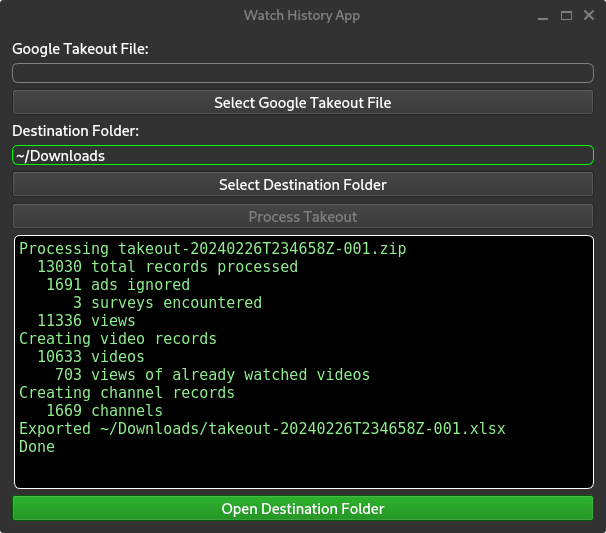
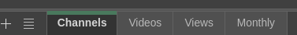
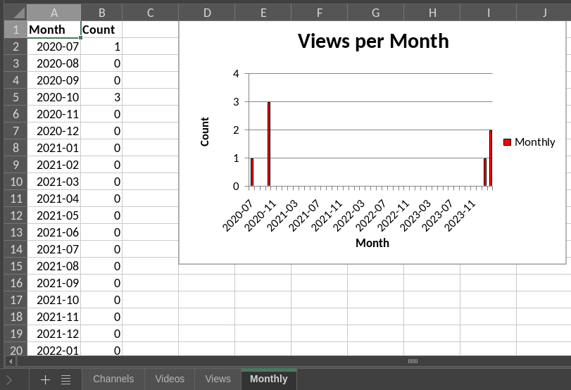
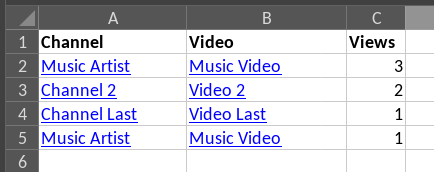

# Watch History
  
Make Sense of Your YouTube Watched History

  

## Motivation

**User-focused -** It’s your data, and you should be empowered to analyze it! 📊

## Features

**Converts YouTube’s Watch History into a Microsoft Excel Spreadsheet:** Easily organize and explore your viewing habits.

**Cross-Platform Compatibility:** Written in Python, the program runs on Windows, Mac, and Linux. The generated spreadsheet can be opened in Excel, LibreOffice, ONLYOFFICE and Gnumeric.

**See Your Data:**
Your data will show up on multiple tabs:
  

See your monthly views as a table and a chart:
  

See the videos and how many times you watched them. The links are clickable:
  

NOTE: In the test sample above, it looks like "Music Artist" is duplicated, but that is because video link is different! One link points to <a href="https://music.youtube.com">music.youtube.com</a> and the other points to <a href="https://www.youtube.com">www.youtube.com</a>. So you you get separate counts for how many times you viewed a video versus listened to it.

## How to Use
Download the code. Alternatively, you can download the release for Windows or Linux on the right of the screen and unzip it to where you want.

Visit <a href="https://takeout.google.com">Google Takeout</a> and export everything from YouTube. I recommend that you switch the YouTube export to use JSON, as that will guarantee that the dates and times are accurate. But even if you don't switch to JSON, the program will do its best to use the local time.
  
Run the program with your exported data to transform your watch history into an insightful spreadsheet. You can leave the export zipped up if you want to, or you can point the program to the "watch-history.html" or "watch-history.json" file.

Open the resulting spreadsheet file in the spreadsheet program of your choice.

You can do it! Take control of your data and explore your YouTube journey.

## Notes From the Author
I was intending to use YouTube's API for the data, but Google [removed the API access](https://developers.google.com/youtube/v3/revision_history#august-11,-2016) to YouTube Watch History in 2016. Therefore, the program processes the Watch History file you can get from Google Takeout instead.
